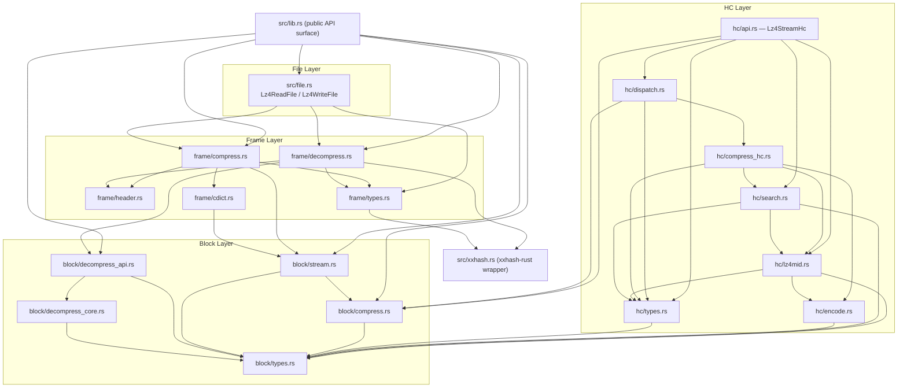
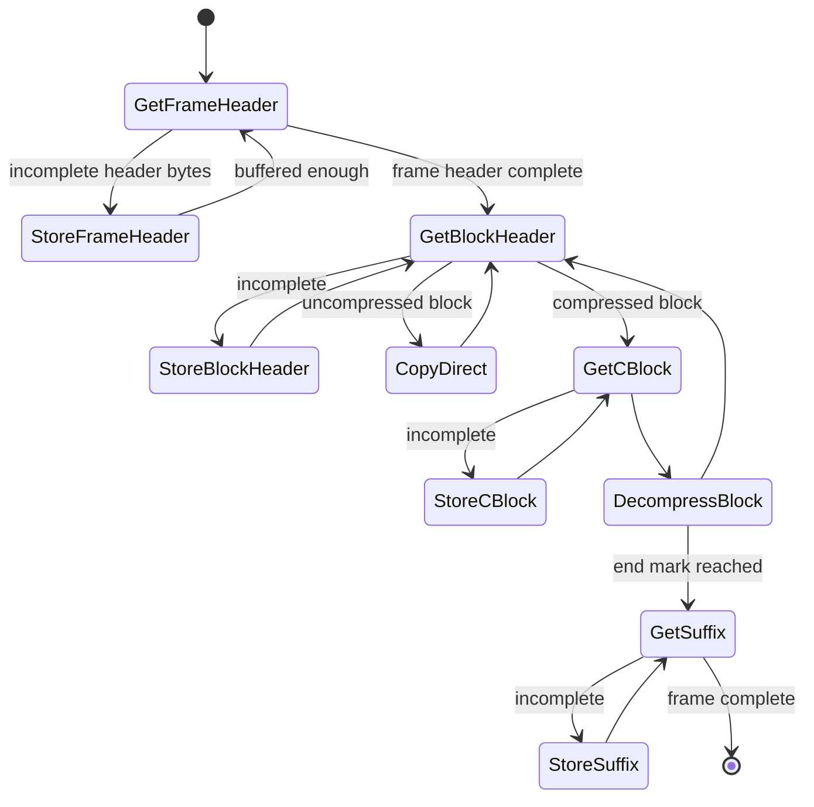

# Architecture Guide: lz4-rust

**Migration**: lz4-to-rust  
**Source**: LZ4 v1.10.0 (C)  
**Target**: Rust (stable, edition 2021)  
**Date**: 2026-02-22  
**Version**: 1.10.0

---

## Overview

`lz4-rust` is a pure-Rust port of the LZ4 v1.10.0 compression library, preserving the full public API surface of the original C library. It provides four compression modes — fast block, high-compression block, streaming frame format, and file I/O — delivered as a single Cargo crate (`lz4`, crate-type `["cdylib", "rlib"]`).

The only external dependency is the `xxhash-rust` crate, which replaces the vendored `xxhash.c`/`xxhash.h` from the C source tree.

---

## Crate Structure

```
lz4-rust/
├── Cargo.toml
└── src/
    ├── lib.rs              # Public re-exports and top-level API
    ├── block/
    │   ├── mod.rs          # Module declaration + re-exports
    │   ├── types.rs        # Constants, type aliases, memory helpers, hash tables
    │   ├── compress.rs     # LZ4_compress_generic + one-shot compress API
    │   ├── decompress_core.rs  # LZ4_decompress_generic (security-critical)
    │   ├── decompress_api.rs   # Public decompress API + streaming decode context
    │   └── stream.rs       # Lz4Stream (streaming compress context)
    ├── hc/
    │   ├── mod.rs          # Module declaration + re-exports
    │   ├── types.rs        # HC constants, context init, level table
    │   ├── encode.rs       # LZ4HC_encodeSequence
    │   ├── search.rs       # HC match search (LZ4HC_searchHC3/4)
    │   ├── lz4mid.rs       # LZ4MID compression strategy
    │   ├── compress_hc.rs  # HC compress loop + optimal parser
    │   ├── dispatch.rs     # compress_generic dispatch + dict routing
    │   └── api.rs          # Lz4StreamHc + public HC API
    ├── frame/
    │   ├── mod.rs          # Module declaration + re-exports
    │   ├── types.rs        # Enums, Preferences, Lz4FCCtx, Lz4FError
    │   ├── header.rs       # Frame header encode/decode
    │   ├── cdict.rs        # Lz4FCDict (pre-computed compression dictionary)
    │   ├── compress.rs     # Frame compression API
    │   └── decompress.rs   # Frame decompression state machine
    ├── file.rs             # Lz4ReadFile<R> / Lz4WriteFile<W>
    └── xxhash.rs           # Thin re-export wrapper for xxhash-rust crate
```

---

## Layer Diagram



---

## Module Descriptions

### `src/lib.rs`

The crate root. Re-exports all public API symbols from `block`, `hc`, `frame`, and `file` sub-modules. Defines version constants (`LZ4_VERSION_MAJOR`, `LZ4_VERSION_MINOR`, `LZ4_VERSION_NUMBER`, `LZ4_VERSION_STRING`) and convenience functions `version_number()` / `version_string()`. Also directly defines in-place buffer size helpers.

### `src/block/`

Port of `lz4.c` / `lz4.h`. The foundational compression engine (Units 1 and 7 of the migration plan).

| File | Responsibility | C Source Lines |
|------|---------------|----------------|
| `types.rs` | Constants, memory helpers, hash tables, `StreamStateInternal` | lz4.c:239–740 |
| `compress.rs` | `compress_generic_validated` + one-shot API, `Lz4Error` | lz4.c:924–1524 |
| `stream.rs` | `Lz4Stream` streaming state | lz4.c:1526–1834 |
| `decompress_core.rs` | `lz4_decompress_generic` (security-critical) | lz4.c:1838–2447 |
| `decompress_api.rs` | Public decompression API, `Lz4StreamDecode` | lz4.c:2448–2760 |

### `src/hc/`

Port of `lz4hc.c` / `lz4hc.h`. High-compression block codec supporting levels 1–12.

| File | Responsibility | C Source Lines |
|------|---------------|----------------|
| `types.rs` | `HcCCtxInternal`, `HcStrategy`, level table, context init | lz4hc.c:71–260 |
| `encode.rs` | `encode_sequence` (token + extended lengths + offset) | lz4hc.c:262–355 |
| `lz4mid.rs` | `lz4mid_compress` (dual-hash mid-quality strategy) | lz4hc.c:357–775 |
| `search.rs` | HC chain search (`search_hc3`, `search_hc4`) | lz4hc.c:776–1000 |
| `compress_hc.rs` | HC compress loop + optimal-parse variant | lz4hc.c:1001–1485 |
| `dispatch.rs` | `compress_generic`: strategy and dict-mode dispatch | lz4hc.c:1001–1485 |
| `api.rs` | `Lz4StreamHc` + full public HC API | lz4hc.c:1486–2192 |

### `src/frame/`

Port of `lz4frame.c` / `lz4frame.h` / `lz4frame_static.h`. Streaming LZ4 frame format.

| File | Responsibility |
|------|---------------|
| `types.rs` | Public enums, `FrameInfo`, `Preferences`, `Lz4FCCtx`, `Lz4FError` |
| `header.rs` | Frame header encode/decode |
| `cdict.rs` | `Lz4FCDict` (pre-loaded fast + HC dictionary) |
| `compress.rs` | Context lifecycle: begin/update/flush/end, `lz4f_compress_frame` |
| `decompress.rs` | `Lz4FDCtx` state machine, `lz4f_decompress` |

### `src/file.rs`

Port of `lz4file.c` / `lz4file.h`. Streaming file-level I/O using generic `R: Read` / `W: Write` in place of C `FILE*`.

### `src/xxhash.rs`

Thin wrapper re-exporting the `xxhash-rust` crate as `Xxh32State` and `xxh32_oneshot`. No unsafe code; intentional crate substitution (see [Decision Log](./decision-log.md)).

---

## Key Architectural Patterns

| C Pattern | Rust Equivalent |
|-----------|----------------|
| Opaque create/free lifecycle (`LZ4_createStream`/`LZ4_freeStream`) | `Box<T>` + `impl Drop` (RAII) |
| `LZ4_FORCE_INLINE` | `#[inline(always)]` |
| `goto _output_error` (error cleanup) | `return Err(...)` |
| `goto _last_literals` (hot-path exit) | `break 'compress` labeled break |
| `goto _copy_continue` (overlap copy) | `loop { ... continue 'copy }` |
| `compressFunc_t` function pointer dispatch | Rust enum + `match` |
| Union for static allocation (`LZ4_stream_u`) | `Box<Lz4Stream>` / `Box<Lz4StreamHc>` |
| `__builtin_ctzll` / `__builtin_clzll` | `u64::trailing_zeros()` / `u64::leading_zeros()` |
| `__builtin_bswap32` / `bswap64` | `u32::swap_bytes()` / `u64::swap_bytes()` |
| `LZ4F_isError()` return-code convention | `Result<usize, Lz4FError>` |
| `LZ4F_CustomMem` allocator hooks | Global allocator (stable Rust) |
| Compile-time enum params (template dispatch) | Rust enums passed as values; compiler inlines |
| Unaligned read (packed union / direct cast) | `core::ptr::read_unaligned` inside `unsafe` |
| `FILE*` | Generic `R: Read` / `W: Write` |

---

## Control Flow: Streaming Frame Decompression



---

## Frame Wire Format

```
┌──────────────────────────────────────────────────────────┐
│  Magic      │ 4 bytes │ 0x184D2204 (LZ4 frame)           │
│  FLG        │ 1 byte  │ Version, flags                    │
│  BD         │ 1 byte  │ Block max size                    │
│  ContentSize│ 0 or 8B │ Optional uncompressed size        │
│  DictID     │ 0 or 4B │ Optional dictionary ID            │
│  HC         │ 1 byte  │ Header checksum (xxhash32 byte 1) │
├──────────────────────────────────────────────────────────┤
│  [ BlockHeader 4B | BlockData | Optional Checksum 4B ] * │
├──────────────────────────────────────────────────────────┤
│  EndMark    │ 4 bytes │ 0x00000000                        │
│  ContentChk │ 0 or 4B │ Optional xxhash32 of all content  │
└──────────────────────────────────────────────────────────┘
```

---

## Configuration

The Rust port hard-codes default C values for all compile-time macros:

| Constant | Value | C Macro |
|----------|-------|---------|
| `LZ4_MEMORY_USAGE` (in `block/types.rs`) | 14 → 16 KB hash table | `LZ4_MEMORY_USAGE` |
| `LZ4_DISTANCE_MAX` | 65535 | `LZ4_DISTANCE_MAX` |
| `LZ4_ACCELERATION_DEFAULT` | 1 | `LZ4_ACCELERATION_DEFAULT` |
| `LZ4_ACCELERATION_MAX` | 65537 | `LZ4_ACCELERATION_MAX` |
| `LZ4HC_CLEVEL_DEFAULT` | 9 | `LZ4HC_CLEVEL_DEFAULT` |
| `LZ4HC_CLEVEL_MAX` | 12 | `LZ4HC_CLEVEL_MAX` |

---

## See Also

- [API Reference](./api-reference.md)
- [Developer Guide](./developer-guide.md)
- [Migration Summary](./migration-summary.md)
- [Decision Log](./decision-log.md)
- [Known Issues](./known-issues.md)
